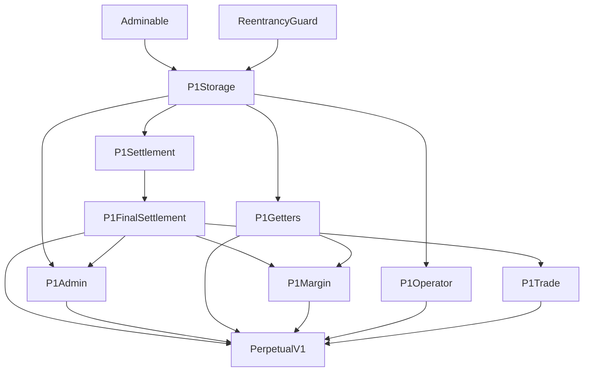
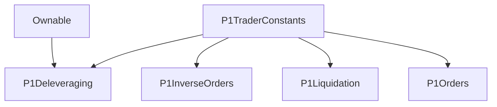

# Dydx 学习笔记

## 代码架构

```
.
├── ./PerpetualV1.sol
├── ./impl
│   ├── ./impl/P1Admin.sol
│   ├── ./impl/P1FinalSettlement.sol
│   ├── ./impl/P1Getters.sol
│   ├── ./impl/P1Margin.sol
│   ├── ./impl/P1Operator.sol
│   ├── ./impl/P1Settlement.sol
│   ├── ./impl/P1Storage.sol
│   └── ./impl/P1Trade.sol
├── ./intf
│   ├── ./intf/I_P1Funder.sol
│   ├── ./intf/I_P1Oracle.sol
│   ├── ./intf/I_P1Trader.sol
│   └── ./intf/I_PerpetualV1.sol
├── ./lib
│   ├── ./lib/P1BalanceMath.sol
│   ├── ./lib/P1IndexMath.sol
│   └── ./lib/P1Types.sol
├── ./oracles
│   ├── ./oracles/P1ChainlinkOracle.sol
│   ├── ./oracles/P1FundingOracle.sol
│   ├── ./oracles/P1InverseFundingOracle.sol
│   ├── ./oracles/P1MakerOracle.sol
│   ├── ./oracles/P1MirrorOracle.sol
│   ├── ./oracles/P1MirrorOracleETHUSD.sol
│   └── ./oracles/P1OracleInverter.sol
├── ./proxies
│   ├── ./proxies/P1CurrencyConverterProxy.sol
│   ├── ./proxies/P1LiquidatorProxy.sol
│   ├── ./proxies/P1Proxy.sol
│   ├── ./proxies/P1SoloBridgeProxy.sol
│   └── ./proxies/P1WethProxy.sol
└── ./traders
    ├── ./traders/P1Deleveraging.sol
    ├── ./traders/P1InverseOrders.sol
    ├── ./traders/P1Liquidation.sol
    ├── ./traders/P1Orders.sol
    └── ./traders/P1TraderConstants.sol
```

### impl



#### P1Settlement
包含账户间资金支付结算逻辑的合约。
```
/*

    Copyright 2020 dYdX Trading Inc.

    Licensed under the Apache License, Version 2.0 (the "License");
    you may not use this file except in compliance with the License.
    You may obtain a copy of the License at

    http://www.apache.org/licenses/LICENSE-2.0

    Unless required by applicable law or agreed to in writing, software
    distributed under the License is distributed on an "AS IS" BASIS,
    WITHOUT WARRANTIES OR CONDITIONS OF ANY KIND, either express or implied.
    See the License for the specific language governing permissions and
    limitations under the License.

*/

pragma solidity 0.5.16;
pragma experimental ABIEncoderV2;

import { SafeMath } from "@openzeppelin/contracts/math/SafeMath.sol";
import { P1Storage } from "./P1Storage.sol";
import { BaseMath } from "../../lib/BaseMath.sol";
import { SafeCast } from "../../lib/SafeCast.sol";
import { SignedMath } from "../../lib/SignedMath.sol";
import { I_P1Funder } from "../intf/I_P1Funder.sol";
import { I_P1Oracle } from "../intf/I_P1Oracle.sol";
import { P1BalanceMath } from "../lib/P1BalanceMath.sol";
import { P1IndexMath } from "../lib/P1IndexMath.sol";
import { P1Types } from "../lib/P1Types.sol";


/**
 * @title P1Settlement
 * @author dYdX
 *
 * @notice Contract containing logic for settling funding payments between accounts.
 */
contract P1Settlement is
    P1Storage
{
    using BaseMath for uint256;
    using SafeCast for uint256;
    using SafeMath for uint256;
    using P1BalanceMath for P1Types.Balance;
    using P1IndexMath for P1Types.Index;
    using SignedMath for SignedMath.Int;

    // ============ Events ============

    event LogIndex(
        bytes32 index
    );

    event LogAccountSettled(
        address indexed account,
        bool isPositive,
        uint256 amount,
        bytes32 balance
    );

    // ============ Functions ============

    /**
     * @dev Calculates the funding change since the last update and stores it in the Global Index.
     *
     * @return Context struct that containing:
     *         - The current oracle price;
     *         - The global index;
     *         - The minimum required collateralization.
     */
    function _loadContext()
        internal
        returns (P1Types.Context memory)
    {
        // SLOAD old index
        // Idex代表每个账户的索引，用来结算，这里获取的是全局的某个币种的索引
        // struct Index {
        //     uint32 timestamp;
        //     bool isPositive;
        //     uint128 value;
        // }        
        P1Types.Index memory index = _GLOBAL_INDEX_;

        // get Price (P)
        // 这里获取价格好像没有具体的币种，可能是每个币种部署一个合约？
        uint256 price = I_P1Oracle(_ORACLE_).getPrice();

        // get Funding (F)
        uint256 timeDelta = block.timestamp.sub(index.timestamp);
        if (timeDelta > 0) {
            // turn the current index into a signed integer
            // SignedMath library for doing math with signed integers.
            SignedMath.Int memory signedIndex = SignedMath.Int({
                value: index.value,
                isPositive: index.isPositive
            });

            // Get the funding rate, applied over the time delta.
            (
                bool fundingPositive,
                uint256 fundingValue
            ) = I_P1Funder(_FUNDER_).getFunding(timeDelta);
            // fundingValue = fundingValue * price / 10**18
            // 相当于把资金费率乘以当前的价格，并且除以10**18
            // 之前返回的fundingValue是一个精度为18位小数的定点数
            fundingValue = fundingValue.baseMul(price);

            // Update the index according to the funding rate, applied over the time delta.
            if (fundingPositive) {
                // 如果当前资金费率是正的，那么说明账户可以收到资金
                signedIndex = signedIndex.add(fundingValue);
            } else {
                // 如果资金费率是负的，说明用户需要支付资金
                signedIndex = signedIndex.sub(fundingValue);
            }

            // store new index
            index = P1Types.Index({
                timestamp: block.timestamp.toUint32(),
                isPositive: signedIndex.isPositive,
                value: signedIndex.value.toUint128()
            });
            _GLOBAL_INDEX_ = index;
        }

        emit LogIndex(index.toBytes32());

        return P1Types.Context({
            price: price,
            minCollateral: _MIN_COLLATERAL_,
            index: index
        });
    }

    /**
     * @dev Settle the funding payments for a list of accounts and return their resulting balances.
     */
    // 根据_loadContext返回的某个币种的索引信息来给账户做结算
    // 这里传入的账户地址列表应该是持有某个币种订单的账户
    function _settleAccounts(
        P1Types.Context memory context,
        address[] memory accounts
    )
        internal
        returns (P1Types.Balance[] memory)
    {
        uint256 numAccounts = accounts.length;
        P1Types.Balance[] memory result = new P1Types.Balance[](numAccounts);

        for (uint256 i = 0; i < numAccounts; i++) {
            result[i] = _settleAccount(context, accounts[i]);
        }

        return result;
    }

    /**
     * @dev Settle the funding payment for a single account and return its resulting balance.
     */
    function _settleAccount(
        P1Types.Context memory context,
        address account
    )
        internal
        returns (P1Types.Balance memory)
    {
        // 这里的索引是某个币种的全局索引
        P1Types.Index memory newIndex = context.index;
        // 获取之前存储的某个账户具体的索引
        P1Types.Index memory oldIndex = _LOCAL_INDEXES_[account];
        // 获取某个账户的保证金和头寸余额
        P1Types.Balance memory balance = _BALANCES_[account];

        // Don't update the index if no time has passed.
        if (oldIndex.timestamp == newIndex.timestamp) {
            return balance;
        }

        // Store a cached copy of the index for this account.
        // 将全局索引存储到用户的索引(作用？)
        _LOCAL_INDEXES_[account] = newIndex;

        // No need for settlement if balance is zero.
        // 用户不持有币种的头寸，则不需要结算
        if (balance.position == 0) {
            return balance;
        }

        // Get the difference between the newIndex and oldIndex.
        SignedMath.Int memory signedIndexDiff = SignedMath.Int({
            isPositive: newIndex.isPositive,
            value: newIndex.value
        });
        if (oldIndex.isPositive) {
            // 如果旧的索引是正的费率，则用当前新的索引值减去旧的索引值
            // 假设当前最新索引的Value为200，费率为正(+200)，旧索引的值为100
            // 则 200 - 100 = 100, 加上当前费率符号相当于+100
            // 假设当前最新索引的Value为200，费率为负(-200)，旧索引的值为100
            // 则 200 - 100 = 100, 加上当前费率符号相当于-100
            // 由于之前的value值是累加的，所以只需要算出前后两次的差值用来计算
            signedIndexDiff = signedIndexDiff.sub(oldIndex.value);
        } else {
            // 如果旧的索引是负的费率，则用当前新的索引值加上旧的索引值
            signedIndexDiff = signedIndexDiff.add(oldIndex.value);
        }

        // By convention, positive funding (index increases) means longs pay shorts
        // and negative funding (index decreases) means shorts pay longs.
        // 如果当前最新索引的费率为正(多头付给空头)且账户持有的头寸为做多，则账户需要付资金给空头， settlementIsPositive 为 false
        // 如果当前最新索引的费率为正(空头付给多头)且账户持有的头寸为做空，则账户获取到多头的资金, settlementIsPositive 为 true
        bool settlementIsPositive = signedIndexDiff.isPositive != balance.positionIsPositive;

        // Settle the account balance by applying the index delta as a credit or debit.
        // The interest amount scales with the position size.
        //
        // We round interest debits up and credits down to ensure that the contract won't become
        // insolvent due to rounding errors.
        uint256 settlementAmount;
        if (settlementIsPositive) { // 用户获得支付资金费率
            // 当前累计资金费率差值 * 账户持有的头寸数量
            settlementAmount = signedIndexDiff.value.baseMul(balance.position);
            // 直接将获得的资金加到账户的保证金里面
            balance.addToMargin(settlementAmount);
        } else { // 用户支付资金费率
            settlementAmount = signedIndexDiff.value.baseMulRoundUp(balance.position);
            balance.subFromMargin(settlementAmount);
        }
        // 更新账户余额
        _BALANCES_[account] = balance;

        // Log the change to the account balance, which is the negative of the change in the index.
        emit LogAccountSettled(
            account,
            settlementIsPositive,
            settlementAmount,
            balance.toBytes32()
        );

        return balance;
    }

    /**
     * @dev Returns true if the balance is collateralized according to the price and minimum
     * collateralization passed-in through the context.
     */
    function _isCollateralized(
        P1Types.Context memory context,
        P1Types.Balance memory balance
    )
        internal
        pure
        returns (bool)
    {
        // 获取账户保证金和头寸
        (uint256 positive, uint256 negative) = balance.getPositiveAndNegativeValue(context.price);

        // Overflow risk assessment:
        // 2^256 / 10^36 is significantly greater than 2^120 and this calculation is therefore not
        // expected to be a limiting factor on the size of accounts that this contract can handle.
        // 
        return positive.mul(BaseMath.base()) >= negative.mul(context.minCollateral);
    }
}

```

#### P1FinalSettlement
账户最终结算提取保证金代币的数量
```
/*

    Copyright 2020 dYdX Trading Inc.

    Licensed under the Apache License, Version 2.0 (the "License");
    you may not use this file except in compliance with the License.
    You may obtain a copy of the License at

    http://www.apache.org/licenses/LICENSE-2.0

    Unless required by applicable law or agreed to in writing, software
    distributed under the License is distributed on an "AS IS" BASIS,
    WITHOUT WARRANTIES OR CONDITIONS OF ANY KIND, either express or implied.
    See the License for the specific language governing permissions and
    limitations under the License.

*/

pragma solidity 0.5.16;
pragma experimental ABIEncoderV2;

import { SafeMath } from "@openzeppelin/contracts/math/SafeMath.sol";
import { IERC20 } from "@openzeppelin/contracts/token/ERC20/IERC20.sol";
import { SafeERC20 } from "@openzeppelin/contracts/token/ERC20/SafeERC20.sol";
import { P1Settlement } from "./P1Settlement.sol";
import { BaseMath } from "../../lib/BaseMath.sol";
import { Math } from "../../lib/Math.sol";
import { P1BalanceMath } from "../lib/P1BalanceMath.sol";
import { P1Types } from "../lib/P1Types.sol";


/**
 * @title P1FinalSettlement
 * @author dYdX
 *
 * @notice Functions regulating the smart contract's behavior during final settlement.
 */
contract P1FinalSettlement is
    P1Settlement
{
    using SafeMath for uint256;

    // ============ Events ============

    event LogWithdrawFinalSettlement(
        address indexed account,
        uint256 amount,
        bytes32 balance
    );

    // ============ Modifiers ============

    /**
    * @dev Modifier to ensure the function is not run after final settlement has been enabled.
    */
    modifier noFinalSettlement() {
        require(
            !_FINAL_SETTLEMENT_ENABLED_,
            "Not permitted during final settlement"
        );
        _;
    }

    /**
    * @dev Modifier to ensure the function is only run after final settlement has been enabled.
    */
    modifier onlyFinalSettlement() {
        require(
            _FINAL_SETTLEMENT_ENABLED_,
            "Only permitted during final settlement"
        );
        _;
    }

    // ============ Functions ============

    /**
     * @notice Withdraw the number of margin tokens equal to the value of the account at the time
     *  that final settlement occurred.
     * @dev Emits the LogAccountSettled and LogWithdrawFinalSettlement events.
     */
    function withdrawFinalSettlement()
        external
        onlyFinalSettlement
        nonReentrant
    {
        // Load the context using the final settlement price.
        P1Types.Context memory context = P1Types.Context({
            price: _FINAL_SETTLEMENT_PRICE_,
            minCollateral: _MIN_COLLATERAL_,
            index: _GLOBAL_INDEX_
        });

        // Apply funding changes.
        // 结算账户最后的资金费率，获取结算后账户的余额
        P1Types.Balance memory balance = _settleAccount(context, msg.sender);

        // Determine the account net value.
        // `positive` and `negative` are base values with extra precision.
        (uint256 positive, uint256 negative) = P1BalanceMath.getPositiveAndNegativeValue(
            balance,
            context.price
        );

        // No amount is withdrawable.
        // 保证金不足以扣除，则无法提取
        if (positive < negative) {
            return;
        }

        // Get the account value, which is rounded down to the nearest token amount.
        uint256 accountValue = positive.sub(negative).div(BaseMath.base());

        // Get the number of tokens in the Perpetual Contract.
        uint256 contractBalance = IERC20(_TOKEN_).balanceOf(address(this));

        // Determine the maximum withdrawable amount.
        uint256 amountToWithdraw = Math.min(contractBalance, accountValue);

        // Update the user's balance.
        uint120 remainingMargin = accountValue.sub(amountToWithdraw).toUint120();
        balance = P1Types.Balance({
            marginIsPositive: remainingMargin != 0, // true 说明账户还有未被领取的保证金
            positionIsPositive: false,  // false 说明账户没有头寸？
            margin: remainingMargin,    // 剩余未被提取的保证金
            position: 0 // 结算后头寸更新为0
        });
        _BALANCES_[msg.sender] = balance;

        // Send the tokens.
        SafeERC20.safeTransfer(
            IERC20(_TOKEN_),
            msg.sender,
            amountToWithdraw
        );

        // Emit the log.
        emit LogWithdrawFinalSettlement(
            msg.sender,
            amountToWithdraw,
            balance.toBytes32()
        );
    }
}

```

#### P1Getters
只读合约，获取账户余额和合约的参数等信息
```
/*

    Copyright 2020 dYdX Trading Inc.

    Licensed under the Apache License, Version 2.0 (the "License");
    you may not use this file except in compliance with the License.
    You may obtain a copy of the License at

    http://www.apache.org/licenses/LICENSE-2.0

    Unless required by applicable law or agreed to in writing, software
    distributed under the License is distributed on an "AS IS" BASIS,
    WITHOUT WARRANTIES OR CONDITIONS OF ANY KIND, either express or implied.
    See the License for the specific language governing permissions and
    limitations under the License.

*/

pragma solidity 0.5.16;
pragma experimental ABIEncoderV2;

import { P1Storage } from "./P1Storage.sol";
import { I_P1Oracle } from "../intf/I_P1Oracle.sol";
import { P1Types } from "../lib/P1Types.sol";


/**
 * @title P1Getters
 * @author dYdX
 *
 * @notice Contract for read-only getters.
 */
contract P1Getters is
    P1Storage
{
    // ============ Account Getters ============

    /**
     * @notice Get the balance of an account, without accounting for changes in the index.
     *
     * @param  account  The address of the account to query the balances of.
     * @return          The balances of the account.
     */
    function getAccountBalance(
        address account
    )
        external
        view
        returns (P1Types.Balance memory)
    {
        return _BALANCES_[account];
    }

    /**
     * @notice Gets the most recently cached index of an account.
     *
     * @param  account  The address of the account to query the index of.
     * @return          The index of the account.
     */
    function getAccountIndex(
        address account
    )
        external
        view
        returns (P1Types.Index memory)
    {
        return _LOCAL_INDEXES_[account];
    }

    /**
     * @notice Gets the local operator status of an operator for a particular account.
     *
     * @param  account   The account to query the operator for.
     * @param  operator  The address of the operator to query the status of.
     * @return           True if the operator is a local operator of the account, false otherwise.
     */
    function getIsLocalOperator(
        address account,
        address operator
    )
        external
        view
        returns (bool)
    {
        return _LOCAL_OPERATORS_[account][operator];
    }

    // ============ Global Getters ============

    /**
     * @notice Gets the global operator status of an address.
     *
     * @param  operator  The address of the operator to query the status of.
     * @return           True if the address is a global operator, false otherwise.
     */
    function getIsGlobalOperator(
        address operator
    )
        external
        view
        returns (bool)
    {
        return _GLOBAL_OPERATORS_[operator];
    }

    /**
     * @notice Gets the address of the ERC20 margin contract used for margin deposits.
     *
     * @return The address of the ERC20 token.
     */
    function getTokenContract()
        external
        view
        returns (address)
    {
        return _TOKEN_;
    }

    /**
     * @notice Gets the current address of the price oracle contract.
     *
     * @return The address of the price oracle contract.
     */
    function getOracleContract()
        external
        view
        returns (address)
    {
        return _ORACLE_;
    }

    /**
     * @notice Gets the current address of the funder contract.
     *
     * @return The address of the funder contract.
     */
    function getFunderContract()
        external
        view
        returns (address)
    {
        return _FUNDER_;
    }

    /**
     * @notice Gets the most recently cached global index.
     *
     * @return The most recently cached global index.
     */
    function getGlobalIndex()
        external
        view
        returns (P1Types.Index memory)
    {
        return _GLOBAL_INDEX_;
    }

    /**
     * @notice Gets minimum collateralization ratio of the protocol.
     *
     * @return The minimum-acceptable collateralization ratio, returned as a fixed-point number with
     *  18 decimals of precision.
     */
    function getMinCollateral()
        external
        view
        returns (uint256)
    {
        return _MIN_COLLATERAL_;
    }

    /**
     * @notice Gets the status of whether final-settlement was initiated by the Admin.
     *
     * @return True if final-settlement was enabled, false otherwise.
     */
    function getFinalSettlementEnabled()
        external
        view
        returns (bool)
    {
        return _FINAL_SETTLEMENT_ENABLED_;
    }

    // ============ Authorized External Getters ============

    /**
     * @notice Gets the price returned by the oracle.
     * @dev Only able to be called by global operators.
     *
     * @return The price returned by the current price oracle.
     */
    function getOraclePrice()
        external
        view
        returns (uint256)
    {
        require(
            _GLOBAL_OPERATORS_[msg.sender],
            "Oracle price requester not global operator"
        );
        return I_P1Oracle(_ORACLE_).getPrice();
    }

    // ============ Public Getters ============

    /**
     * @notice Gets whether an address has permissions to operate an account.
     *
     * @param  account   The account to query.
     * @param  operator  The address to query.
     * @return           True if the operator has permission to operate the account,
     *                   and false otherwise.
     */
    function hasAccountPermissions(
        address account,
        address operator
    )
        public
        view
        returns (bool)
    {
        return account == operator
            || _GLOBAL_OPERATORS_[operator]
            || _LOCAL_OPERATORS_[account][operator];
    }
}

```

#### P1Margin
用于存款与取款的合约
```
/*

    Copyright 2020 dYdX Trading Inc.

    Licensed under the Apache License, Version 2.0 (the "License");
    you may not use this file except in compliance with the License.
    You may obtain a copy of the License at

    http://www.apache.org/licenses/LICENSE-2.0

    Unless required by applicable law or agreed to in writing, software
    distributed under the License is distributed on an "AS IS" BASIS,
    WITHOUT WARRANTIES OR CONDITIONS OF ANY KIND, either express or implied.
    See the License for the specific language governing permissions and
    limitations under the License.

*/

pragma solidity 0.5.16;
pragma experimental ABIEncoderV2;

import { IERC20 } from "@openzeppelin/contracts/token/ERC20/IERC20.sol";
import { SafeERC20 } from "@openzeppelin/contracts/token/ERC20/SafeERC20.sol";
import { P1FinalSettlement } from "./P1FinalSettlement.sol";
import { P1Getters } from "./P1Getters.sol";
import { P1BalanceMath } from "../lib/P1BalanceMath.sol";
import { P1Types } from "../lib/P1Types.sol";


/**
 * @title P1Margin
 * @author dYdX
 *
 * @notice Contract for withdrawing and depositing.
 */
contract P1Margin is
    P1FinalSettlement,
    P1Getters
{
    using P1BalanceMath for P1Types.Balance;

    // ============ Events ============

    event LogDeposit(
        address indexed account,
        uint256 amount,
        bytes32 balance
    );

    event LogWithdraw(
        address indexed account,
        address destination,
        uint256 amount,
        bytes32 balance
    );

    // ============ Functions ============

    /**
     * @notice Deposit some amount of margin tokens from the msg.sender into an account.
     * @dev Emits LogIndex, LogAccountSettled, and LogDeposit events.
     *
     * @param  account  The account for which to credit the deposit.
     * @param  amount   the amount of tokens to deposit.
     */
    function deposit(
        address account,
        uint256 amount
    )
        external
        noFinalSettlement
        nonReentrant
    {
        P1Types.Context memory context = _loadContext();
        P1Types.Balance memory balance = _settleAccount(context, account);

        SafeERC20.safeTransferFrom(
            IERC20(_TOKEN_),
            msg.sender,
            address(this),
            amount
        );

        balance.addToMargin(amount);
        _BALANCES_[account] = balance;

        emit LogDeposit(
            account,
            amount,
            balance.toBytes32()
        );
    }

    /**
     * @notice Withdraw some amount of margin tokens from an account to a destination address.
     * @dev Emits LogIndex, LogAccountSettled, and LogWithdraw events.
     *
     * @param  account      The account for which to debit the withdrawal.
     * @param  destination  The address to which the tokens are transferred.
     * @param  amount       The amount of tokens to withdraw.
     */
    function withdraw(
        address account,
        address destination,
        uint256 amount
    )
        external
        noFinalSettlement
        nonReentrant
    {
        require(
            hasAccountPermissions(account, msg.sender),
            "sender does not have permission to withdraw"
        );

        P1Types.Context memory context = _loadContext();
        P1Types.Balance memory balance = _settleAccount(context, account);

        SafeERC20.safeTransfer(
            IERC20(_TOKEN_),
            destination,
            amount
        );

        balance.subFromMargin(amount);
        _BALANCES_[account] = balance;
        
        // 要求提取之后剩余的保证金余额可以覆盖头寸所需要的最小保证金
        require(
            _isCollateralized(context, balance),
            "account not collateralized"
        );

        emit LogWithdraw(
            account,
            destination,
            amount,
            balance.toBytes32()
        );
    }
}

```

#### P1Trade
两个账户之间结算交易的合约
```
/*

    Copyright 2020 dYdX Trading Inc.

    Licensed under the Apache License, Version 2.0 (the "License");
    you may not use this file except in compliance with the License.
    You may obtain a copy of the License at

    http://www.apache.org/licenses/LICENSE-2.0

    Unless required by applicable law or agreed to in writing, software
    distributed under the License is distributed on an "AS IS" BASIS,
    WITHOUT WARRANTIES OR CONDITIONS OF ANY KIND, either express or implied.
    See the License for the specific language governing permissions and
    limitations under the License.

*/

pragma solidity 0.5.16;
pragma experimental ABIEncoderV2;

import { SafeMath } from "@openzeppelin/contracts/math/SafeMath.sol";
import { P1FinalSettlement } from "./P1FinalSettlement.sol";
import { BaseMath } from "../../lib/BaseMath.sol";
import { Require } from "../../lib/Require.sol";
import { I_P1Trader } from "../intf/I_P1Trader.sol";
import { P1BalanceMath } from "../lib/P1BalanceMath.sol";
import { P1Types } from "../lib/P1Types.sol";


/**
 * @title P1Trade
 * @author dYdX
 *
 * @notice Contract for settling trades between two accounts. A "trade" in this context may refer
 *  to any approved transfer of balances, as determined by the smart contracts implementing the
 *  I_P1Trader interface and approved as global operators on the PerpetualV1 contract.
 */
contract P1Trade is
    P1FinalSettlement
{
    using SafeMath for uint120;
    using P1BalanceMath for P1Types.Balance;

    // ============ Structs ============

    struct TradeArg {
        uint256 takerIndex;
        uint256 makerIndex;
        address trader;
        bytes data;
    }

    // ============ Events ============

    event LogTrade(
        address indexed maker,
        address indexed taker,
        address trader,
        uint256 marginAmount,
        uint256 positionAmount,
        bool isBuy, // from taker's perspective
        bytes32 makerBalance,
        bytes32 takerBalance
    );

    // ============ Functions ============

    /**
     * @notice Submits one or more trades between any number of accounts.
     * @dev Emits the LogIndex event, one LogAccountSettled event for each account in `accounts`,
     *  and the LogTrade event for each trade in `trades`.
     *
     * @param  accounts  The sorted list of accounts that are involved in trades.
     * @param  trades    The list of trades to execute in-order.
     */
    function trade(
        address[] memory accounts,
        TradeArg[] memory trades
    )
        public
        noFinalSettlement
        nonReentrant
    {
        // 检查账户列表不为空且每个账户都唯一
        _verifyAccounts(accounts);
        P1Types.Context memory context = _loadContext();
        P1Types.Balance[] memory initialBalances = _settleAccounts(context, accounts);
        P1Types.Balance[] memory currentBalances = new P1Types.Balance[](initialBalances.length);

        uint256 i;
        for (i = 0; i < initialBalances.length; i++) {
            currentBalances[i] = initialBalances[i].copy();
        }

        bytes32 traderFlags = 0;
        for (i = 0; i < trades.length; i++) {
            TradeArg memory tradeArg = trades[i];

            // trader必须为global operator
            require(
                _GLOBAL_OPERATORS_[tradeArg.trader],
                "trader is not global operator"
            );

            address maker = accounts[tradeArg.makerIndex];
            address taker = accounts[tradeArg.takerIndex];

            P1Types.TradeResult memory tradeResult = I_P1Trader(tradeArg.trader).trade(
                msg.sender,
                maker,
                taker,
                context.price,
                tradeArg.data,
                traderFlags
            );

            traderFlags |= tradeResult.traderFlags;

            // If the accounts are equal, no need to update balances.
            if (maker == taker) {
                continue;
            }

            // Modify currentBalances in-place. Note that `isBuy` is from the taker's perspective.
            P1Types.Balance memory makerBalance = currentBalances[tradeArg.makerIndex];
            P1Types.Balance memory takerBalance = currentBalances[tradeArg.takerIndex];
            if (tradeResult.isBuy) {
                makerBalance.addToMargin(tradeResult.marginAmount);
                makerBalance.subFromPosition(tradeResult.positionAmount);
                takerBalance.subFromMargin(tradeResult.marginAmount);
                takerBalance.addToPosition(tradeResult.positionAmount);
            } else {
                makerBalance.subFromMargin(tradeResult.marginAmount);
                makerBalance.addToPosition(tradeResult.positionAmount);
                takerBalance.addToMargin(tradeResult.marginAmount);
                takerBalance.subFromPosition(tradeResult.positionAmount);
            }

            // Store the new balances in storage.
            _BALANCES_[maker] = makerBalance;
            _BALANCES_[taker] = takerBalance;

            emit LogTrade(
                maker,
                taker,
                tradeArg.trader,
                tradeResult.marginAmount,
                tradeResult.positionAmount,
                tradeResult.isBuy,
                makerBalance.toBytes32(),
                takerBalance.toBytes32()
            );
        }

        _verifyAccountsFinalBalances(
            context,
            accounts,
            initialBalances,
            currentBalances
        );
    }

    /**
     * @dev Verify that `accounts` contains at least one address and that the contents are unique.
     *  We verify uniqueness by requiring that the array is sorted.
     */
    function _verifyAccounts(
        address[] memory accounts
    )
        private
        pure
    {
        require(
            accounts.length > 0,
            "Accounts must have non-zero length"
        );

        // Check that accounts are unique
        address prevAccount = accounts[0];
        for (uint256 i = 1; i < accounts.length; i++) {
            address account = accounts[i];
            require(
                account > prevAccount,
                "Accounts must be sorted and unique"
            );
            prevAccount = account;
        }
    }

    /**
     * Verify that account balances at the end of the tx are allowable given the initial balances.
     *
     * We require that for every account, either:
     * 1. The account meets the collateralization requirement; OR
     * 2. All of the following are true:
     *   a) The absolute value of the account position has not increased;
     *   b) The sign of the account position has not flipped positive to negative or vice-versa.
     *   c) The account's collateralization ratio has not worsened;
     */
    function _verifyAccountsFinalBalances(
        P1Types.Context memory context,
        address[] memory accounts,
        P1Types.Balance[] memory initialBalances,
        P1Types.Balance[] memory currentBalances
    )
        private
        pure
    {
        for (uint256 i = 0; i < accounts.length; i++) {
            P1Types.Balance memory currentBalance = currentBalances[i];
            (uint256 currentPos, uint256 currentNeg) =
                currentBalance.getPositiveAndNegativeValue(context.price);

            // See P1Settlement._isCollateralized().
            bool isCollateralized =
                currentPos.mul(BaseMath.base()) >= currentNeg.mul(context.minCollateral);

            if (isCollateralized) {
                continue;
            }

            address account = accounts[i];
            P1Types.Balance memory initialBalance = initialBalances[i];
            (uint256 initialPos, uint256 initialNeg) =
                initialBalance.getPositiveAndNegativeValue(context.price);

            Require.that(
                currentPos != 0,
                "account is undercollateralized and has no positive value",
                account
            );
            Require.that(
                currentBalance.position <= initialBalance.position,
                "account is undercollateralized and absolute position size increased",
                account
            );

            // Note that currentBalance.position can't be zero at this point since that would imply
            // either currentPos is zero or the account is well-collateralized.

            Require.that(
                currentBalance.positionIsPositive == initialBalance.positionIsPositive,
                "account is undercollateralized and position changed signs",
                account
            );
            Require.that(
                initialNeg != 0,
                "account is undercollateralized and was not previously",
                account
            );

            // Note that at this point:
            //   Absolute position size must have decreased and not changed signs.
            //   Initial margin/position must be one of -/-, -/+, or +/-.
            //   Current margin/position must now be either -/+ or +/-.
            //
            // Which implies one of the following [intial] -> [current] configurations:
            //   [-/-] -> [+/-]
            //   [-/+] -> [-/+]
            //   [+/-] -> [+/-]

            // Check that collateralization increased.
            // In the case of [-/-] initial, initialPos == 0 so the following will pass. Otherwise:
            // at this point, either initialNeg and currentNeg represent the margin values, or
            // initialPos and currentPos do. Since the margin is multiplied by the base value in
            // getPositiveAndNegativeValue(), it is safe to use baseDivMul() to divide the margin
            // without any rounding. This is important to avoid the possibility of overflow.
            Require.that(
                currentBalance.positionIsPositive
                    ? currentNeg.baseDivMul(initialPos) <= initialNeg.baseDivMul(currentPos)
                    : initialPos.baseDivMul(currentNeg) <= currentPos.baseDivMul(initialNeg),
                "account is undercollateralized and collateralization decreased",
                account
            );
        }
    }
}

```

### trader


#### P1Orders

#### P1Deleveraging

#### P1InverseOrders

#### P1Liquidation

#### P1TraderConstants


### proxy

#### P1CurrencyConverterProxy

#### P1LiquidatorProxy

#### P1Proxy

#### P1SoloBridgeProxy

#### P1WethProxy
