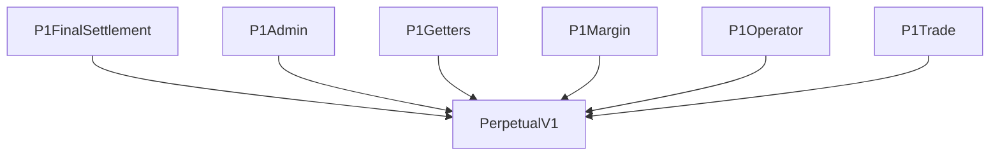
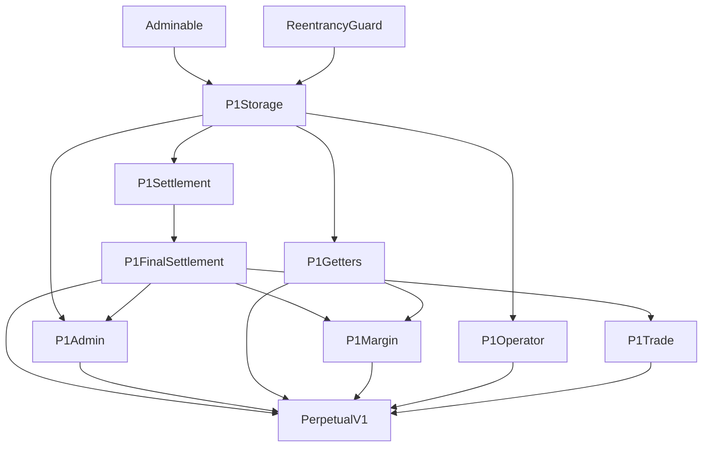
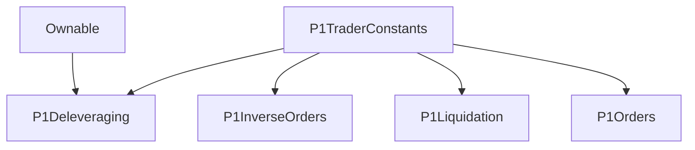

# Dydx 合约源码分析

## 概述
dydx和一般中心化交易所的模式一样，采用订单簿模型。这意味着一个人要在某个价位想做空某个币，那么也必须有个人在该价位去做多该币种，这样才能撮合成功。这也就意味着不需要一个借款方来提供借款服务，因为做空者和做多者各持有相同数量的做空头寸和做多头寸。

所有的合约交易者都需要提供保证金，交易者的损失将直接从保证金种扣除用来支付给盈利方，此外保证金还会用来扣除交易手续费和资金费率。最小保证金比例指的是对某个代币进行交易时，保证金价值和交易代币的实际价值的比。例如如果ETH-USDC的最小保证金比例为110%，那么如果要做空价值100美金的ETH需要抵押110USDC。

假设交易对为ETH-USDC，一般的做空做多机制如下：

- 如果是做多ETH，则向借款方借入USDC，并将USDC换成ETH，后续结算时再将ETH卖出成USDC，将USDC连本带息还给借款方。此时用户需要USDC作为抵押品。
- 如果是做空ETH，则向借款方借入ETH，并将ETH换成USDC，后续结算时将USDC买回ETH，将ETH连本带息还给借款方。此时用户需要USDC作为抵押品。

方便理解，提供一个简化了的例子如下，假设最小保证金比例为110%(保证金价值/持仓头寸价值)，也就是说如果保证金比例低于110%则用户将被清算：

1. A进行挂单在1000美金以5倍的杠杆做空以太坊，提供保证金为220，则做空的以太坊数量为: 220/110% * 5 / 1000 = 1 ETH。假设当前不存在在1000美金做多以太坊的挂单，所以A此时的订单没有及时成交，故A称为挂单者(maker)。
2. B在1000美金以10倍做多以太坊，提供保证金为110，则做多的以太坊数量为： 110 / 110% * 10 / 1000 = 1 ETH。由于之前存在了A在1000美金做空的挂单，所以B可以立即成交，此时B成为吃单者(taker)。
3. 此时A和B撮合成功，A持有1个以太坊多单头寸，B持有1个以太坊空单头寸，在没有第三方借款方的情况下双方都获得了所需的头寸。当然为了简化此时我们不考虑手续费和资金费率的问题。由于A的杠杆倍数为5倍，则以太坊价格当上涨1/5 = 20%时A的头寸将被清算。B的杠杆倍数为10倍，则以太坊价格下降1/10 = 10%时B的头寸将被清算。
4. 当此时ETH价格上涨了2%，即1020美金。此时A将损失2% * 5 = 10% (也就是200 * 10% =  20美金)，B将盈利2 * 10 = 20% (也就是100 * 20 % = 20 美金)。

## 代码架构

Dydx的V1版本Solidity合约目录结构如下：
```
.
├── ./PerpetualV1.sol // 入口实现合约
├── ./impl     // 核心逻辑
│   ├── ./impl/P1Admin.sol
│   ├── ./impl/P1FinalSettlement.sol
│   ├── ./impl/P1Getters.sol
│   ├── ./impl/P1Margin.sol
│   ├── ./impl/P1Operator.sol
│   ├── ./impl/P1Settlement.sol
│   ├── ./impl/P1Storage.sol
│   └── ./impl/P1Trade.sol
├── ./intf    // 核心接口
│   ├── ./intf/I_P1Funder.sol
│   ├── ./intf/I_P1Oracle.sol
│   ├── ./intf/I_P1Trader.sol
│   └── ./intf/I_PerpetualV1.sol
├── ./lib    // 公共库
│   ├── ./lib/P1BalanceMath.sol
│   ├── ./lib/P1IndexMath.sol
│   └── ./lib/P1Types.sol
├── ./oracles    // 预言机合约
│   ├── ./oracles/P1ChainlinkOracle.sol
│   ├── ./oracles/P1FundingOracle.sol
│   ├── ./oracles/P1InverseFundingOracle.sol
│   ├── ./oracles/P1MakerOracle.sol
│   ├── ./oracles/P1MirrorOracle.sol
│   ├── ./oracles/P1MirrorOracleETHUSD.sol
│   └── ./oracles/P1OracleInverter.sol
├── ./proxies    // 代理合约
│   ├── ./proxies/P1CurrencyConverterProxy.sol
│   ├── ./proxies/P1LiquidatorProxy.sol
│   ├── ./proxies/P1Proxy.sol
│   ├── ./proxies/P1SoloBridgeProxy.sol
│   └── ./proxies/P1WethProxy.sol
└── ./traders    // 交易者合约，供impl中的合约调用
    ├── ./traders/P1Deleveraging.sol
    ├── ./traders/P1InverseOrders.sol
    ├── ./traders/P1Liquidation.sol
    ├── ./traders/P1Orders.sol
    └── ./traders/P1TraderConstants.sol
    
```

其中PerpetualV1.sol为入口合约，继承其他功能模块合约：

可以看到PerpetualV1继承的模块都来自impl目录中的合约，impl中的合约为交易的核心模块。

PerpetualV1的初始化函数主要设置了USDC代币，代币价格预言机，资金费率合约的地址和最小抵押率。
```
function initializeV1(
        address token,             // 保证金代币地址，即USDC地址
        address oracle,            // 代币价格预言机地址，来自P1MakerOracle合约
        address funder,            // 资金利率预言机的地址，来自P1FundingOracle合约
        uint256 minCollateral      // 最小抵押率，例如110%则记为1100000000000000000 
    )
        external
        onlyAdmin
        nonReentrant
    {
        // only allow initialization once
        require(
            Storage.load(PERPETUAL_V1_INITIALIZE_SLOT) == 0x0,
            "PerpetualV1 already initialized"
        );
        Storage.store(PERPETUAL_V1_INITIALIZE_SLOT, bytes32(uint256(1)));

        _TOKEN_ = token;
        _ORACLE_ = oracle;
        _FUNDER_ = funder;
        _MIN_COLLATERAL_ = minCollateral;

        _GLOBAL_INDEX_ = P1Types.Index({
            timestamp: uint32(block.timestamp),
            isPositive: false,
            value: 0
        });
    }
```


### impl
impl目录中的合约是核心的逻辑实现合约。


为方便理解，下面从顶向下分析各个合约的主要功能逻辑。

#### P1Margin
P1Margin合约用于存款与取款，在第一次进行做空或做多之前，我们首先需要在平台中进行存款的操作，存款存入的是USDC，如果使用其他代币存入会先在Uniswap等平台将该代币兑换成USDC后再存入。

##### deposit
P1Margin合约的存款函数如下：
```
function deposit(
        address account,    // 存款的账户地址
        uint256 amount      // 存款数量
    )
        external
        noFinalSettlement
        nonReentrant
    {
        // 调用P1FinalSettlement合约，获取上下文信息
        P1Types.Context memory context = _loadContext();
        // 调用P1FinalSettlement合约，结算并更新账户余额
        // 每次存款时都进行一次结算操作，这时用户承担结算的费用
        // 结算操作主要是根据账户当前的持仓头寸和资金费率，更新账户的保证金余额
        P1Types.Balance memory balance = _settleAccount(context, account);

        // 从_TOKEN_合约中将账户要存款的金额转入本合约
        // _TOKEN_合约地址即为USDC的合约地址
        SafeERC20.safeTransferFrom(
            IERC20(_TOKEN_),
            msg.sender,
            address(this),
            amount
        );

        // 更新账户的保证金余额
        balance.addToMargin(amount);
        _BALANCES_[account] = balance;

        emit LogDeposit(
            account,
            amount,
            balance.toBytes32()
        );
    }
```

`_loadContext`函数计算自上次更新以来的资金变更，并将其存储在Global Index中，实现如下：
```
 /**
     * @dev Calculates the funding change since the last update and stores it in the Global Index.
     *
     * @return Context struct that containing:
     *         - The current oracle price;
     *         - The global index;
     *         - The minimum required collateralization.
     */
    // 计算自上次更新以来的资金变更，并将其存储在Global Index中
    function _loadContext()
        internal
        returns (P1Types.Context memory)
    {
        // SLOAD old index
        // Idex代表每个账户的索引，用来结算，这里获取的是全局的某个币种的索引
        // struct Index {
        //     uint32 timestamp; 
        //     bool isPositive;  
        //     uint128 value;
        // }        
        P1Types.Index memory index = _GLOBAL_INDEX_;

        // get Price (P)
        // 这里使用预言机获取代币的价格，例如ETH-USDC交易对，则为获取ETH相对于USDC的价格
        uint256 price = I_P1Oracle(_ORACLE_).getPrice();

        // get Funding (F)
        uint256 timeDelta = block.timestamp.sub(index.timestamp);
        if (timeDelta > 0) {
            // turn the current index into a signed integer
            // SignedMath library for doing math with signed integers.
            SignedMath.Int memory signedIndex = SignedMath.Int({
                value: index.value,
                isPositive: index.isPositive
            });

            // Get the funding rate, applied over the time delta.
            // 获取资金费率
            (
                bool fundingPositive,
                uint256 fundingValue
            ) = I_P1Funder(_FUNDER_).getFunding(timeDelta);
            // fundingValue = fundingValue * price / 10**18
            // 相当于把资金费率乘以当前的价格，并且除以10**18
            // 之前返回的fundingValue是一个精度为18位小数的定点数
            fundingValue = fundingValue.baseMul(price);

            // Update the index according to the funding rate, applied over the time delta.
            // 分几种情况：
            // 1.如果资金费率之前为正的，现在也为正的，那么直接将绝对值相加，再取正号
            // 2.如果资金费率之前为负的，现在为正的，那么需要将较大的绝对值减去较小的绝对值，再取绝对值大的那个的符号
            // 3.如果资金费率之前为正的，现在为负的，那么需要将较大的绝对值减去较小的绝对值，再取绝对值大的那个的符号
            // 4.如果资金费率之前为负的，现在也为负的，那么直接将绝对值相加，再取负号
            if (fundingPositive) {
                // 如果当前资金费率是正的，那么直接相加
                // add函数实现了有符号a + 无符号b的算法
                signedIndex = signedIndex.add(fundingValue);
            } else {
                // 如果资金费率是负的，那么减去该值
                signedIndex = signedIndex.sub(fundingValue);
            }

            // store new index
            index = P1Types.Index({
                timestamp: block.timestamp.toUint32(),
                isPositive: signedIndex.isPositive,
                value: signedIndex.value.toUint128()
            });
            _GLOBAL_INDEX_ = index;
        }

        emit LogIndex(index.toBytes32());

        return P1Types.Context({
            price: price,
            minCollateral: _MIN_COLLATERAL_,
            index: index
        });
    }

```

接下来是`_settleAccount`函数，该函数会根据上述`_loadContext`获取的资金费率和代币价格等信心来对账户进行结算，然后更新账户的保证金余额。
```
function _settleAccount(
        P1Types.Context memory context,
        address account
    )
        internal
        returns (P1Types.Balance memory)
    {
        // 这里的索引是某个币种的全局索引
        P1Types.Index memory newIndex = context.index;
        // 获取之前存储的某个账户具体的索引
        P1Types.Index memory oldIndex = _LOCAL_INDEXES_[account];
        // 获取某个账户的保证金和头寸余额
        P1Types.Balance memory balance = _BALANCES_[account];

        // Don't update the index if no time has passed.
        if (oldIndex.timestamp == newIndex.timestamp) {
            return balance;
        }

        // Store a cached copy of the index for this account.
        // 更新全局索引存储到用户的本地缓存索引
        _LOCAL_INDEXES_[account] = newIndex;

        // No need for settlement if balance is zero.
        // 用户不持有币种的头寸，则不需要结算
        if (balance.position == 0) {
            return balance;
        }

        // Get the difference between the newIndex and oldIndex.
        SignedMath.Int memory signedIndexDiff = SignedMath.Int({
            isPositive: newIndex.isPositive,
            value: newIndex.value
        });
        // 计算新旧两次资金费率的差值：新值-旧值
        if (oldIndex.isPositive) {
            // 如果旧的索引是正的资金费率，则用当前新的索引值减去旧的索引值
            // sub函数实现了一个有符号数a减去一个无符号数b的功能
            // 例如 a = -1, b = 2, 则 a - b = -3
            // 这里的算法是取 a, b的绝对值相加，结果符号取负号
            signedIndexDiff = signedIndexDiff.sub(oldIndex.value);
        } else {
            // 如果旧的索引是负的费率，则用当前新的索引值加上旧的索引值
            // add函数实现了一个有符号数a加上一个无符号数b的功能
            signedIndexDiff = signedIndexDiff.add(oldIndex.value);
        }

        // By convention, positive funding (index increases) means longs pay shorts
        // and negative funding (index decreases) means shorts pay longs.
        // 如果当前最新索引的费率为正(多头付给空头)且账户持有的头寸为做多，则账户需要付资金给空头， settlementIsPositive 为 false
        // 如果当前最新索引的费率为正(空头付给多头)且账户持有的头寸为做空，则账户获取到多头的资金, settlementIsPositive 为 true
        bool settlementIsPositive = signedIndexDiff.isPositive != balance.positionIsPositive;

        // Settle the account balance by applying the index delta as a credit or debit.
        // The interest amount scales with the position size.
        //
        // We round interest debits up and credits down to ensure that the contract won't become
        // insolvent due to rounding errors.
        uint256 settlementAmount;
        if (settlementIsPositive) { // 用户获得支付资金费率
            // 当前累计资金费率差值 * 账户持有的头寸数量
            settlementAmount = signedIndexDiff.value.baseMul(balance.position);
            // 直接将获得的资金加到账户的保证金里面
            balance.addToMargin(settlementAmount);
        } else { // 用户支付资金费率
            settlementAmount = signedIndexDiff.value.baseMulRoundUp(balance.position);
            balance.subFromMargin(settlementAmount);
        }
        // 更新账户余额
        _BALANCES_[account] = balance;

        // Log the change to the account balance, which is the negative of the change in the index.
        emit LogAccountSettled(
            account,
            settlementIsPositive,
            settlementAmount,
            balance.toBytes32()
        );

        return balance;
    }

```
值得注意的是，如果资金费率为正(说明代币的合约价格相对于现货价格上溢)，则多头付给空头资金(即做多者支付给做空者)，以此来鼓励大家去做空，从而使代币合约价格趋向于现货价格。

##### withdraw
取款函数和存款函数相反，也是先结算账户的资金费率后再将要提取的金额转给账户。
```
function withdraw(
        address account,
        address destination,
        uint256 amount
    )
        external
        noFinalSettlement
        nonReentrant
    {
        // 判断交易的发送者拥有取款的权限
        require(
            hasAccountPermissions(account, msg.sender),
            "sender does not have permission to withdraw"
        );

        P1Types.Context memory context = _loadContext();
        P1Types.Balance memory balance = _settleAccount(context, account);

        // 将取款的保证金转给取款账户指定的地址
        SafeERC20.safeTransfer(
            IERC20(_TOKEN_),
            destination,
            amount
        );

        balance.subFromMargin(amount);
        _BALANCES_[account] = balance;
        
        // 要求提取之后剩余的保证金余额可以覆盖头寸所需要的最小保证金
        require(
            _isCollateralized(context, balance),
            "account not collateralized"
        );

        emit LogWithdraw(
            account,
            destination,
            amount,
            balance.toBytes32()
        );
    }
```

#### P1Trade
P1Trade合约用于两个账户之间进行结算交易，核心逻辑在`trade`方法中，`trade`方法用来账户的订单交易：
```
function trade(
        address[] memory accounts,
        TradeArg[] memory trades
    )
        public
        noFinalSettlement
        nonReentrant
    {
        // 检查账户列表不为空且每个账户都唯一
        _verifyAccounts(accounts);
        P1Types.Context memory context = _loadContext();
        P1Types.Balance[] memory initialBalances = _settleAccounts(context, accounts);
        P1Types.Balance[] memory currentBalances = new P1Types.Balance[](initialBalances.length);

        uint256 i;
        for (i = 0; i < initialBalances.length; i++) {
            currentBalances[i] = initialBalances[i].copy();
        }

        bytes32 traderFlags = 0;
        for (i = 0; i < trades.length; i++) {
            TradeArg memory tradeArg = trades[i];

            // trader必须为global operator
            require(
                _GLOBAL_OPERATORS_[tradeArg.trader],
                "trader is not global operator"
            );

            address maker = accounts[tradeArg.makerIndex];
            address taker = accounts[tradeArg.takerIndex];

            // 实际调用traders/P1Orders中的trade函数
            P1Types.TradeResult memory tradeResult = I_P1Trader(tradeArg.trader).trade(
                msg.sender,
                maker,
                taker,
                context.price,
                tradeArg.data,
                traderFlags
            );

            traderFlags |= tradeResult.traderFlags;

            // If the accounts are equal, no need to update balances.
            // 如果挂单者和吃单者是同一个人，则不需要更新余额
            if (maker == taker) {
                continue;
            }

            // Modify currentBalances in-place. Note that `isBuy` is from the taker's perspective.
            P1Types.Balance memory makerBalance = currentBalances[tradeArg.makerIndex];
            P1Types.Balance memory takerBalance = currentBalances[tradeArg.takerIndex];
            // 做空者相当于将交易代币换成USDC，所以保证金余额会增加，交易代币头寸余额会减少
            // 做多者相当于将USDC代币换成交易代币，所以保证金余额会减少，交易代币头寸余额会增多
            if (tradeResult.isBuy) {    // taker 角度如果是购买订单(做多)，maker角度为做空卖出
                // maker的保证金数量需要加上新订单成交所需的保证金
                makerBalance.addToMargin(tradeResult.marginAmount);
                // maker的持有头寸需要减去新订单成交的头寸数量
                makerBalance.subFromPosition(tradeResult.positionAmount);
                // taker所持有的保证金需要减去订单成交所需的保证金
                takerBalance.subFromMargin(tradeResult.marginAmount);
                // taker的持有头寸需要加上新订单成交的头寸数量
                takerBalance.addToPosition(tradeResult.positionAmount);
            } else {    // taker 角度如果是出售订单(做空), maker角度为做多买入
                makerBalance.subFromMargin(tradeResult.marginAmount);
                makerBalance.addToPosition(tradeResult.positionAmount);
                takerBalance.addToMargin(tradeResult.marginAmount);
                takerBalance.subFromPosition(tradeResult.positionAmount);
            }

            // Store the new balances in storage.
            _BALANCES_[maker] = makerBalance;
            _BALANCES_[taker] = takerBalance;

            emit LogTrade(
                maker,
                taker,
                tradeArg.trader,
                tradeResult.marginAmount,
                tradeResult.positionAmount,
                tradeResult.isBuy,
                makerBalance.toBytes32(),
                takerBalance.toBytes32()
            );
        }

        // 验证最后账户余额是否正确
        _verifyAccountsFinalBalances(
            context,
            accounts,
            initialBalances,
            currentBalances
        );
    }

```
方法内部调用了一个`I_P1Trader`接口合约中的一个同名`trade`函数，该函数的实现在traders/P1Orders.sol合约中，方法返回一个交易结果的数据结构`TradeResult`：
```
// traders/P1Orders.sol
function trade(
        address sender,         // 交易发送者
        address maker,          // 订单的创建者，即挂单者
        address taker,          // 订单的接收者，即吃单者
        uint256 price,          // 交易的币种的价格
        bytes calldata data,    // 交易订单参数
        bytes32 /* traderFlags */
    )
        external
        returns (P1Types.TradeResult memory)
    {
        address perpetual = _PERPETUAL_V1_;

        // 只能perpetual合约进行调用
        require(
            msg.sender == perpetual,
            "msg.sender must be PerpetualV1"
        );

        if (taker != sender) {
            // sender 如果不是 taker，则sender必须获得taker的授权
            require(
                P1Getters(perpetual).hasAccountPermissions(taker, sender),
                "Sender does not have permissions for the taker"
            );
        }

        TradeData memory tradeData = abi.decode(data, (TradeData));
        bytes32 orderHash = _getOrderHash(tradeData.order);

        // validations
        // 检查订单的状态和订单的签名为maker进行签名
        _verifyOrderStateAndSignature(
            tradeData,
            orderHash
        );
        
        // 检查订单的价格，资金费率和数量等是否有效
        _verifyOrderRequest(
            tradeData,
            maker,
            taker,
            perpetual,
            price
        );

        // set _FILLED_AMOUNT_
        uint256 oldFilledAmount = _FILLED_AMOUNT_[orderHash];
        uint256 newFilledAmount = oldFilledAmount.add(tradeData.fill.amount);
        // Fill订单表示当前成交的订单，由于Order中设置的数量可以部分成交
        // 当前成交的数量必须 <= 订单设定的数量
        require(
            newFilledAmount <= tradeData.order.amount,
            "Cannot overfill order"
        );
        _FILLED_AMOUNT_[orderHash] = newFilledAmount;

        emit LogOrderFilled(
            orderHash,
            tradeData.order.flags,
            tradeData.order.triggerPrice,
            tradeData.fill
        );

        // Order fee is denoted as a percentage of execution price.
        // Convert into an amount per unit position.
        // 单位手续费 = fee * price
        uint256 fee = tradeData.fill.fee.baseMul(tradeData.fill.price);

        // `isBuyOrder` is from the maker's perspective.
        bool isBuyOrder = _isBuy(tradeData.order);
        // 如果是购买订单(做多)且资金费率为负(空头支付给多头)，则每单位头寸所需的保证金需要减去手续费
        // 如果是购买订单(做多)且资金费率为正(多头支付给空头)，则每单位头寸所需的保证金需要加上手续费
        uint256 marginPerPosition = (isBuyOrder == tradeData.fill.isNegativeFee)
            ? tradeData.fill.price.sub(fee)
            : tradeData.fill.price.add(fee);

        return P1Types.TradeResult({
            // 保证金数量 = 每单位头寸所需保证金 * 订单成交头寸数量
            marginAmount: tradeData.fill.amount.baseMul(marginPerPosition),
            positionAmount: tradeData.fill.amount,
            isBuy: !isBuyOrder, // 从taker角度看的话，isBuy正好和maker相反
            traderFlags: TRADER_FLAG_ORDERS
        });
    }

```
其中`_verifyOrderRequest`方法用来检查订单的价格，资金费率和数量等是否有效：

```
function _verifyOrderRequest(
        TradeData memory tradeData,
        address maker,
        address taker,
        address perpetual,
        uint256 price
    )
        private
        view
    {
        require(
            tradeData.order.maker == maker,
            "Order maker does not match maker"
        );
        require(
            tradeData.order.taker == taker || tradeData.order.taker == address(0),
            "Order taker does not match taker"
        );
        require(
            tradeData.order.expiration >= block.timestamp || tradeData.order.expiration == 0,
            "Order has expired"
        );

        // `isBuyOrder` is from the maker's perspective.
        // 对于maker来说该订单是否是购买订单(做多)
        // fill相当于吃单的数量，order为挂单时的数量
        bool isBuyOrder = _isBuy(tradeData.order);
        // 如果是购买订单，则部分购买成交订单的购买价格要小于等于设置好的限价单
        // 如果是出售订单，则部分出售订单的出售成交价格要大于等于设置好的限价单
        bool validPrice = isBuyOrder
            ? tradeData.fill.price <= tradeData.order.limitPrice
            : tradeData.fill.price >= tradeData.order.limitPrice;
        require(
            validPrice,
            "Fill price is invalid"
        );

        // 检查是否是有效的资金费率
        // 如果是负的交易手续费，则fill（吃单）的订单手续费为负且fill的手续费必须 >= order的限价交易手续费
        // 如果是正的交易手续费，则fill（吃单）的订单手续费为负 || fill的交易手续费 <= order的限价交易手续费
        bool validFee = _isNegativeLimitFee(tradeData.order)
            ? tradeData.fill.isNegativeFee && tradeData.fill.fee >= tradeData.order.limitFee
            : tradeData.fill.isNegativeFee || tradeData.fill.fee <= tradeData.order.limitFee;
        require(
            validFee,
            "Fill fee is invalid"
        );

        // 如果账户订单设置了触发价格
        if (tradeData.order.triggerPrice != 0) {
            // 如果是购买订单，且当前价格>=触发价格，则触发有效
            // 如果是出售订单，且当前价格<=触发价格，则触发有效
            bool validTriggerPrice = isBuyOrder
                ? tradeData.order.triggerPrice <= price
                : tradeData.order.triggerPrice >= price;
            require(
                validTriggerPrice,
                "Trigger price has not been reached"
            );
        }
        // 如果订单是仅减仓模式
        if (_isDecreaseOnly(tradeData.order)) {
            P1Types.Balance memory balance = P1Getters(perpetual).getAccountBalance(maker);
            // 
            require(
                isBuyOrder != balance.positionIsPositive     // True:如果账户的操作是减仓
                && tradeData.fill.amount <= balance.position, // True:如果执行的交易小于等于用户所持有的仓位
                "Fill does not decrease position"
            );
        }
    }

```


#### P1FinalSettlement
P1FinalSettlement合约用来进行账户最终结算提取保证金代币的数量。主要逻辑在`withdrawFinalSettlement`方法中：
```
function withdrawFinalSettlement()
        external
        onlyFinalSettlement
        nonReentrant
    {
        // Load the context using the final settlement price.
        P1Types.Context memory context = P1Types.Context({
            price: _FINAL_SETTLEMENT_PRICE_,
            minCollateral: _MIN_COLLATERAL_,
            index: _GLOBAL_INDEX_
        });

        // Apply funding changes.
        // 结算账户最后的资金费率，获取结算后账户的余额
        P1Types.Balance memory balance = _settleAccount(context, msg.sender);

        // Determine the account net value.
        // `positive` and `negative` are base values with extra precision.
        (uint256 positive, uint256 negative) = P1BalanceMath.getPositiveAndNegativeValue(
            balance,
            context.price
        );

        // No amount is withdrawable.
        // 保证金不足以扣除，则无法提取
        if (positive < negative) {
            return;
        }

        // Get the account value, which is rounded down to the nearest token amount.
        // 获取账户可提取的金额： positive - negative
        uint256 accountValue = positive.sub(negative).div(BaseMath.base());

        // Get the number of tokens in the Perpetual Contract.
        uint256 contractBalance = IERC20(_TOKEN_).balanceOf(address(this));

        // Determine the maximum withdrawable amount.
        uint256 amountToWithdraw = Math.min(contractBalance, accountValue);

        // Update the user's balance.
        uint120 remainingMargin = accountValue.sub(amountToWithdraw).toUint120();
        balance = P1Types.Balance({
            marginIsPositive: remainingMargin != 0, // true 说明账户还有未被领取的保证金
            positionIsPositive: false,              // false 说明账户没有头寸？
            margin: remainingMargin,                // 剩余未被提取的保证金
            position: 0                             // 结算后头寸更新为0
        });
        _BALANCES_[msg.sender] = balance;

        // Send the tokens.
        SafeERC20.safeTransfer(
            IERC20(_TOKEN_),
            msg.sender,
            amountToWithdraw
        );

        // Emit the log.
        emit LogWithdrawFinalSettlement(
            msg.sender,
            amountToWithdraw,
            balance.toBytes32()
        );
    }
```


#### P1Settlement
包含账户间资金支付结算逻辑的合约。

#### P1Getters
只读合约，获取账户余额和合约的参数等信息。


### trader



### proxy

#### P1LiquidatorProxy
合约允许低于最低抵押的帐户被另一个帐户清算。这允许该帐户部分或全部头寸纳入清算人。所有清算利润的一部分直接用于保险基金。
```
    function liquidate(
        address liquidatee,     // 要被清算的账户
        address liquidator,     // 进行清算的账户
        bool isBuy,             // 如果是true则说明被清算人持有多头头寸，否则为空头头寸
        SignedMath.Int calldata maxPosition // 清算人在清算后所持有的最大头寸
    )
        external
        returns (uint256)
    {
        I_PerpetualV1 perpetual = I_PerpetualV1(_PERPETUAL_V1_);

        // Verify that this account can liquidate for the liquidator.
        // 发送交易的账户必须是清算人或者已经被被清算人授权
        require(
            liquidator == msg.sender || perpetual.hasAccountPermissions(liquidator, msg.sender),
            "msg.sender cannot operate the liquidator account"
        );

        // Settle the liquidator's account and get balances.
        // 获取清算人的账户余额
        perpetual.deposit(liquidator, 0);
        P1Types.Balance memory initialBalance = perpetual.getAccountBalance(liquidator);

        // Get the maximum liquidatable amount.
        // 获取清算人可以清算的最大的头寸
        SignedMath.Int memory maxPositionDelta = _getMaxPositionDelta(
            initialBalance,
            isBuy,
            maxPosition
        );

        // Do the liquidation.
        _doLiquidation(
            perpetual,
            liquidatee,
            liquidator,
            maxPositionDelta
        );

        // Get the balances of the liquidator.
        // 清算完成后获取当前清算人的最新余额
        P1Types.Balance memory currentBalance = perpetual.getAccountBalance(liquidator);

        // Get the liquidated amount and fee amount.
        // 根据清算人的当前头寸余额和清算前的头寸余额获取被清算的数量
        // 并根据清算人的清算收益获取应收取的清算手续费
        (uint256 liqAmount, uint256 feeAmount) = _getLiquidatedAndFeeAmount(
            perpetual,
            initialBalance,
            currentBalance
        );

        // Transfer fee from liquidator to insurance fund.
        if (feeAmount > 0) {
            perpetual.withdraw(liquidator, address(this), feeAmount);
            perpetual.deposit(_INSURANCE_FUND_, feeAmount);
        }

        // Log the result.
        emit LogLiquidatorProxyUsed(
            liquidatee,
            liquidator,
            isBuy,
            liqAmount,
            feeAmount
        );

        return liqAmount;
    }
```
其中`_doLiquidation`函数进行具体的清算：
```
function _doLiquidation(
        I_PerpetualV1 perpetual,
        address liquidatee, 
        address liquidator,
        SignedMath.Int memory maxPositionDelta
    )
        private
    {
        // Create accounts. Base protocol requires accounts to be sorted.
        // 对账号进行排序
        // maker被清算者
        // taker为清算者
        bool takerFirst = liquidator < liquidatee;
        address[] memory accounts = new address[](2);
        uint256 takerIndex = takerFirst ? 0 : 1;
        uint256 makerIndex = takerFirst ? 1 : 0;
        accounts[takerIndex] = liquidator;
        accounts[makerIndex] = liquidatee;

        // Create trade args.
        I_PerpetualV1.TradeArg[] memory trades = new I_PerpetualV1.TradeArg[](1);
        trades[0] = I_PerpetualV1.TradeArg({
            takerIndex: takerIndex,
            makerIndex: makerIndex,
            trader: _LIQUIDATION_,
            data: abi.encode(
                maxPositionDelta.value,
                maxPositionDelta.isPositive,
                false // allOrNothing
            )
        });

        // Do the liquidation.
        // 调用P1Trade.sol合约的trade函数
        // P1Trade.sol合约的trade函数最后调用traders/P1Liquidation.sol中的trade方法完成清算
        perpetual.trade(accounts, trades);
    }

```

`_doLiquidation`中最后调用了P1Trade.sol合约的`trade`方法，`trade`方法里面又调用了traders/P1Liquidation.sol中的trade方法:
```
// traders/P1Liquidation.sol
function trade(
        address sender,
        address maker,
        address taker,
        uint256 price,
        bytes calldata data,
        bytes32 /* traderFlags */
    )
        external
        returns (P1Types.TradeResult memory)
    {
        address perpetual = _PERPETUAL_V1_;

        require(
            msg.sender == perpetual,
            "msg.sender must be PerpetualV1"
        );

        require(
            P1Getters(perpetual).getIsGlobalOperator(sender),
            "Sender is not a global operator"
        );

        TradeData memory tradeData = abi.decode(data, (TradeData));
        P1Types.Balance memory makerBalance = P1Getters(perpetual).getAccountBalance(maker);

        // 验证清算订单的参数正确
        _verifyTrade(
            tradeData,
            makerBalance,
            perpetual,
            price
        );

        // Bound the execution amount by the size of the maker position.
        uint256 amount = Math.min(tradeData.amount, makerBalance.position);

        // When partially liquidating the maker, maintain the same position/margin ratio.
        // Ensure the collateralization of the maker does not decrease.
        uint256 marginAmount;
        if (tradeData.isBuy) {
            // 等比例扣除被清算人的保证金
            // 保证金数量 = 保证金余额 * (清算头寸数量 / 持有头寸数量)
            marginAmount = uint256(makerBalance.margin).getFractionRoundUp(
                amount,
                makerBalance.position
            );
        } else {
            marginAmount = uint256(makerBalance.margin).getFraction(amount, makerBalance.position);
        }

        emit LogLiquidated(
            maker,
            taker,
            amount,
            tradeData.isBuy,
            price
        );

        return P1Types.TradeResult({
            marginAmount: marginAmount,
            positionAmount: amount,
            isBuy: tradeData.isBuy,
            traderFlags: TRADER_FLAG_LIQUIDATION
        });
    }

function _verifyTrade(
        TradeData memory tradeData,
        P1Types.Balance memory makerBalance,
        address perpetual,
        uint256 price
    )
        private
        view
    {
        // 检查被清算人是否已经到达被清算条件
        require(
            _isUndercollateralized(makerBalance, perpetual, price),
            "Cannot liquidate since maker is not undercollateralized"
        );
        // 清算数量不能大于账户可清算的头寸
        require(
            !tradeData.allOrNothing || makerBalance.position >= tradeData.amount,
            "allOrNothing is set and maker position is less than amount"
        );
        // 清算只能减少被清算人的头寸，不能增加
        require(
            tradeData.isBuy == makerBalance.positionIsPositive,
            "liquidation must not increase maker's position size"
        );

        // Disallow liquidating in the edge case where both the position and margin are negative.
        //
        // This case is not handled correctly by P1Trade. If an account is in this situation, the
        // margin should first be set to zero via a deposit, then the account should be deleveraged.
        // 被清算账户的保证金和头寸不能都为负
        require(
            makerBalance.marginIsPositive || makerBalance.margin == 0 ||
                makerBalance.positionIsPositive || makerBalance.position == 0,
            "Cannot liquidate when maker position and margin are both negative"
        );
    }


```

#### P1CurrencyConverterProxy
(todo)

#### P1Proxy
(todo)

#### P1SoloBridgeProxy
(todo)

#### P1WethProxy
(todo)


#### P1Orders
(todo)

#### P1Deleveraging
(todo)

#### P1InverseOrders
(todo)

#### P1Liquidation
(todo)

#### P1TraderConstants
(todo)